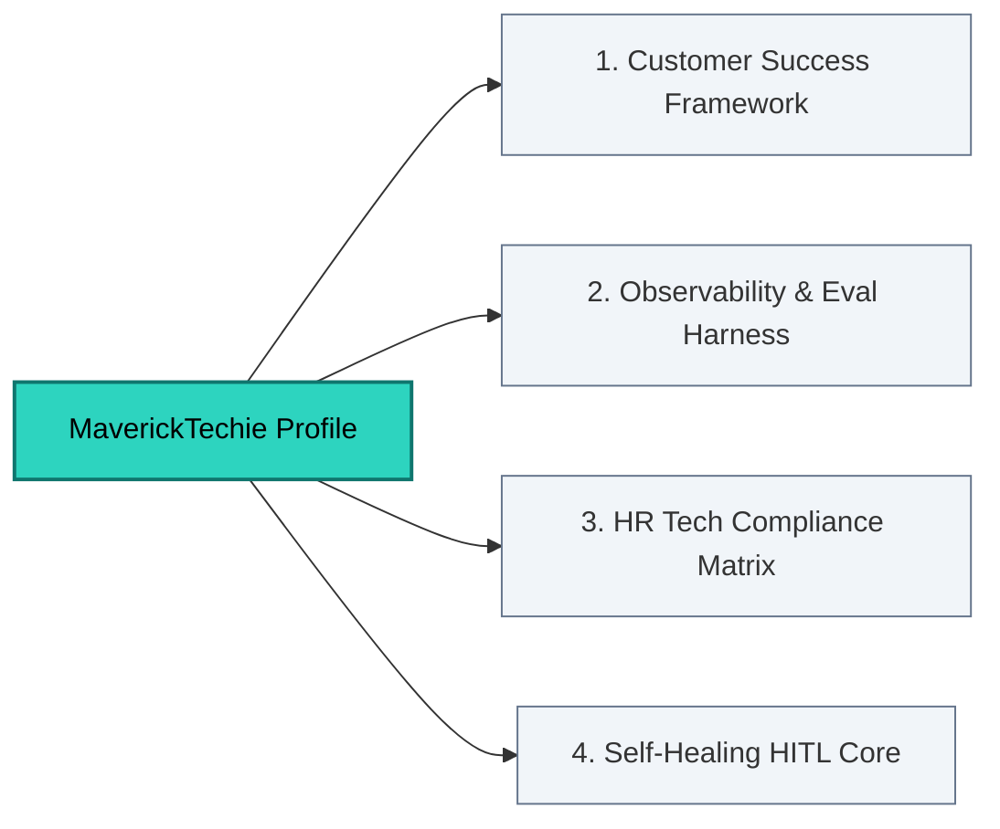

# Mahendra P | Agentic AI Practitioner & Operational Excellence
> "Translating complex agentic AI capability into reliable enterprise outcomes that cross-border IT leaders can confidently act on."

---

## 🎯 Strategic Alignment Matrix
* **Core Focus**: AI Adoption, Operational Scaling, and Global Client Success Management.
* **Specialties**: LangGraph Stateful Orchestration, Human-in-the-Loop (HITL) Workflow Design, AI TRiSM, and Regulated Industry Compliance.
* **Target Audience**: Mid-to-Large IT Firms, Global B2B Startups, and Enterprises serving US/EU accounts.

---

## 🎛️ Live Agentic AI Architectures

### 1. 📈 [enterprise-cs-agent-framework](https://github.com)
An enterprise framework tracking client health vectors. Features a production-grade **Durable HITL Serialization Layer** that holds automated communication paths until human account leads approve the strategy.

### 2. 👁️ [agent-observability-eval-harness](https://github.com)
A comprehensive observability framework utilizing OpenTelemetry standards to trace agent tool execution paths, calculate API cost vectors, and run regression-testing pipelines across intent matrices.

### 3. 🏛️ [ai-workforce-adoption-matrix](https://github.com)
A secure, policy-compliant pipeline designed for internal HR tech and enterprise talent optimization. Combines LLM-as-a-Judge evaluators with PII obfuscation filters to map employee technical competencies.

### 4. 🔧 [self-healing-hitl-core](https://github.com)
An automated diagnostic platform running a closed-loop error remediation pipeline. Intercepts runtime log anomalies, generates isolated codebase fixes, and halts at an operational boundary requiring physical human validation.
